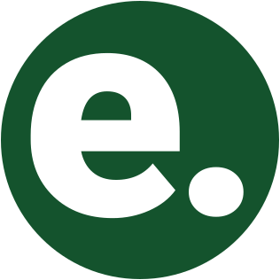

## Final work for Riga Coding School certification

### Using
- [Laravel](https://laravel.com/)
- [React](https://react.dev/)
- [Inertia](https://inertiajs.com/)
- [Tailwind](https://tailwindcss.com/)

### Code

[Github](https://github.com/folkmanis/rcs-laravel-work)

### Demo

Live [demo](demo.folkmanis.id.lv). Feel free to register and try out!

## License

Licensed under the [MIT license](https://opensource.org/licenses/MIT).
